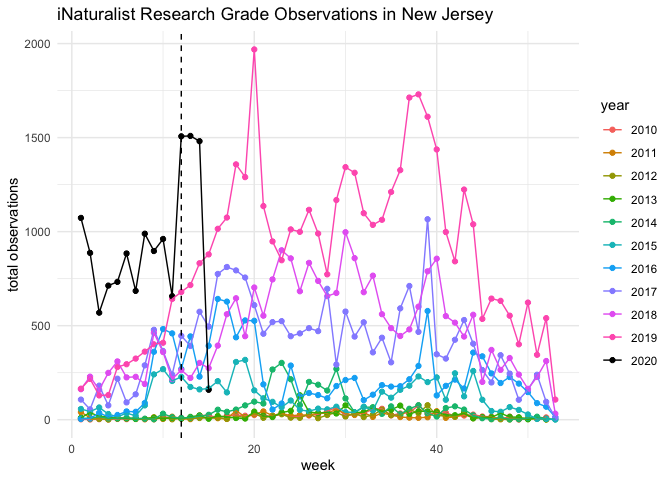
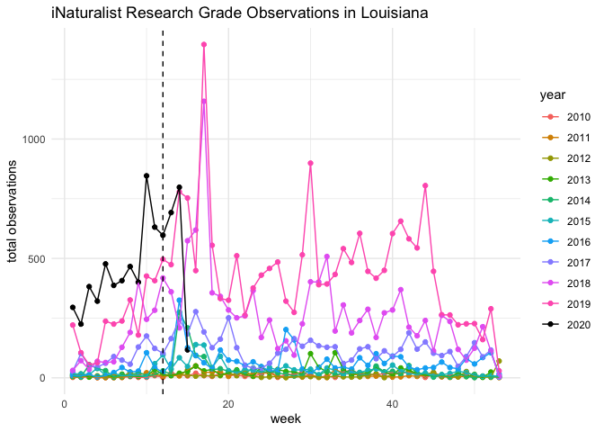
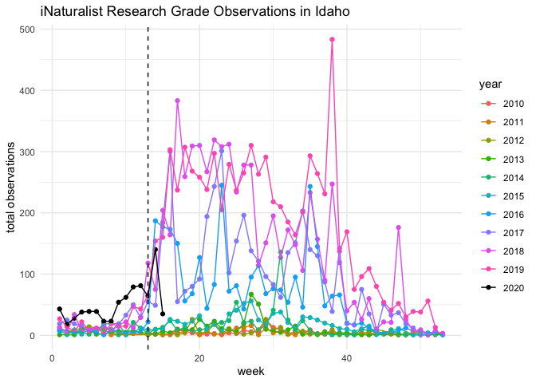
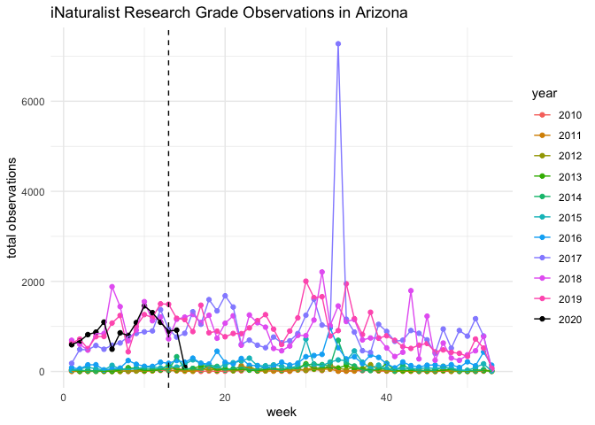

iNaturalist during COVID crisis
================
Sara Stoudt
4/17/2020

``` r
library(dplyr)
library(stringr)
library(ggplot2)
library(readr)
library(lubridate)
library(scales)
setwd("~/Desktop/covid_citizen_science")
inat5 = read_csv("iNatNice.csv")


stayAtHome = read_csv("stayAtHomeDates.csv")

dateInfo = strsplit(stayAtHome$stayAtHomeDate, "/")

stayAtHome$month = unlist(lapply(dateInfo, function(x){x[1]}))
stayAtHome$day = unlist(lapply(dateInfo, function(x){x[2]}))
stayAtHome$year = unlist(lapply(dateInfo, function(x){x[3]}))

stayAtHome$dateNice=as.Date(paste("2020",str_pad(stayAtHome$month,width = 2, side = "left",pad = "0"),str_pad(stayAtHome$day,width = 2, side = "left",pad = "0"), sep="-" ))
```

``` r
inat5$week = week(ymd(inat5$eventDate))
totals = inat5 %>% group_by(month, year) %>% summarise(count = n())
totals$fakeDate = as.Date(paste("2025",str_pad(totals$month,width = 2, side = "left",pad = "0"), "01", sep="-"))

#https://stackoverflow.com/questions/8197559/emulate-ggplot2-default-color-palette
ggplotColours <- function(n = 6, h = c(0, 360) + 15){
  if ((diff(h) %% 360) < 1) h[2] <- h[2] - 360/n
  hcl(h = (seq(h[1], h[2], length = n)), c = 100, l = 65)
}
#scales:::show_col(ggplotColours(n= 10))


colScale <- scale_color_manual(name = "year",values = c(ggplotColours(n=10),"black"))
```

## By Month and Year Overall

``` r
ggplot(totals, aes(fakeDate, count, col=as.factor(year), group=as.factor(year)))+geom_point()+geom_line() +theme_minimal()+colScale+scale_x_date(labels = date_format("%b"))+xlab("")+ylab("total observations")+ggtitle("iNaturalist Research Grade Observations in US")
```

<!-- -->

``` r
totalsState = inat5 %>% group_by(week, year, stateProvince) %>% summarise(count = n())

byStatePlot = function(state){
  test = subset(totalsState, stateProvince==state)
  id = which(stayAtHome$state==state)
  ggplot(test, aes(week, count, group=year, col=as.factor(year)))+geom_point()+geom_line()+colScale+theme_minimal()+ylab("total observations")+ggtitle(paste("iNaturalist Research Grade Observations in", state, sep=" "))+geom_vline(xintercept=week(as.Date(paste("2020",str_pad(stayAtHome$month[id],width = 2, side = "left",pad = "0"),str_pad(stayAtHome$day[id],width = 2, side = "left",pad = "0"), sep="-" ))), lty=2)
  
}
```

## By State

Vertical dashed line represents when a stay at home order was put in
place.

``` r
byStatePlot("California")
```

<!-- -->

``` r
byStatePlot("New York")
```

<!-- -->

## By State in Order of Shutdown (earliest to latest)

``` r
stayAtHome = stayAtHome %>% arrange(dateNice)

for(i in 2:nrow(stayAtHome)){ ## skip puerto rico
  print(byStatePlot(stayAtHome$state[i]))
}
```

<!-- --><!-- --><!-- --><!-- --><!-- --><!-- --><!-- --><!-- --><!-- --><!-- --><!-- --><!-- --><!-- --><!-- --><!-- --><!-- --><!-- --><!-- --><!-- --><!-- --><!-- --><!-- --><!-- --><!-- --><!-- --><!-- --><!-- --><!-- --><!-- --><!-- --><!-- --><!-- --><!-- --><!-- --><!-- --><!-- --><!-- --><!-- --><!-- --><!-- --><!-- --><!-- --><!-- --><!-- --><!-- --><!-- -->
